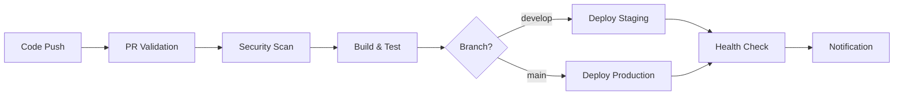

# CI/CD Pipeline Documentation

## Overview

The Lead Management Automation (LMA) platform uses GitHub Actions for Continuous Integration and Continuous Deployment (CI/CD). This document outlines the complete CI/CD strategy, pipeline configuration, and deployment processes.

## Pipeline Architecture



## Workflow Files

### 1. Main CI/CD Pipeline (`.github/workflows/ci-cd.yml`)

**Triggers:**
- Push to `main` or `develop` branches
- Pull requests to `main`

**Jobs:**
1. **test-backend**: Tests FastAPI backend with PostgreSQL and Redis
2. **test-frontend**: Tests SvelteKit frontend with linting and type checking
3. **security-scan**: Vulnerability scanning with Trivy
4. **build-and-push**: Builds and pushes Docker images to GitHub Container Registry
5. **deploy-staging**: Deploys to staging environment (develop branch)
6. **deploy-production**: Deploys to production environment (main branch)
7. **notify**: Sends deployment notifications

### 2. Pull Request Validation (`.github/workflows/pr-validation.yml`)

**Triggers:**
- Pull request opened, synchronized, or reopened

**Jobs:**
1. **code-quality**: Python and JavaScript code quality checks
2. **dockerfile-lint**: Dockerfile linting with Hadolint
3. **docker-compose-validate**: Docker Compose configuration validation
4. **api-contract-test**: API contract testing
5. **security-scan**: CodeQL security analysis
6. **pr-size-check**: PR size validation

### 3. Docker Health Check (`.github/workflows/docker-health-check.yml`)

**Triggers:**
- Scheduled (every 6 hours)
- Manual trigger
- Changes to Docker files

**Jobs:**
1. **docker-compose-test**: Full Docker Compose stack testing
2. **security-baseline**: Docker security baseline scanning

## Environment Setup

### Development Environment
- Uses `docker-compose.yml`
- Local environment variables
- Development database credentials
- Debug logging enabled

### Staging Environment
- Uses `docker-compose.yml` with staging overrides
- Staging-specific environment variables
- Production-like configuration
- Automated deployment from `develop` branch

### Production Environment
- Uses `docker-compose.prod.yml`
- Production environment variables
- Optimized resource limits
- Manual approval required
- Automated deployment from `main` branch

## Required Secrets

Configure these secrets in your GitHub repository:

### Deployment Secrets
```
STAGING_HOST          # Staging server hostname/IP
STAGING_USER          # SSH username for staging
STAGING_SSH_KEY       # SSH private key for staging
PRODUCTION_HOST       # Production server hostname/IP
PRODUCTION_USER       # SSH username for production
PRODUCTION_SSH_KEY    # SSH private key for production
```

### Notification Secrets
```
SLACK_WEBHOOK_URL     # Slack webhook for notifications
```

### Registry Secrets
- `GITHUB_TOKEN` (automatically provided)

## Deployment Scripts

### Bash Script (`scripts/deploy.sh`)
Cross-platform deployment script for Unix-like systems.

**Usage:**
```bash
# Basic deployment
./scripts/deploy.sh development

# Production deployment with backup and health check
./scripts/deploy.sh production --backup --health-check

# Staging deployment with image rebuild
./scripts/deploy.sh staging --build
```

### PowerShell Script (`scripts/deploy.ps1`)
Windows-compatible deployment script.

**Usage:**
```powershell
# Basic deployment
.\scripts\deploy.ps1 development

# Production deployment with backup and health check
.\scripts\deploy.ps1 production -Backup -HealthCheck

# Staging deployment with image rebuild
.\scripts\deploy.ps1 staging -Build
```

## Testing Strategy

### Backend Testing
- **Unit Tests**: Python unit tests with pytest
- **Integration Tests**: Database and Redis integration tests
- **API Tests**: FastAPI endpoint testing
- **Security Tests**: Bandit security scanning
- **Dependency Tests**: Safety vulnerability scanning

### Frontend Testing
- **Unit Tests**: Svelte component testing
- **Type Checking**: TypeScript validation
- **Linting**: ESLint code quality
- **Build Tests**: Production build validation

### Infrastructure Testing
- **Docker Tests**: Container health and communication
- **Compose Tests**: Multi-service orchestration
- **Security Tests**: Container vulnerability scanning
- **Performance Tests**: Resource usage validation

## Quality Gates

### Pull Request Requirements
1. ✅ All tests passing
2. ✅ Code quality checks passing
3. ✅ Security scans clean
4. ✅ PR size reasonable (<1000 lines)
5. ✅ Dockerfile linting passing
6. ✅ Docker Compose validation

### Deployment Requirements
1. ✅ All PR requirements met
2. ✅ Branch protection rules satisfied
3. ✅ Docker images built successfully
4. ✅ Security baseline met

## Monitoring and Notifications

### Health Checks
- **Database**: PostgreSQL connection and query tests
- **Cache**: Redis connectivity tests
- **API**: Backend health endpoint validation
- **Frontend**: Application accessibility tests
- **Workflow Engine**: n8n service validation

### Notifications
- **Slack Integration**: Success/failure notifications
- **GitHub Status Checks**: PR and commit status updates
- **Email Alerts**: Critical failure notifications

## Rollback Strategy

### Automated Rollback
```bash
# Rollback to previous deployment
./scripts/deploy.sh production --rollback
```

### Manual Rollback
1. Identify previous stable commit/tag
2. Deploy specific version:
   ```bash
   git checkout <stable-commit>
   ./scripts/deploy.sh production --build
   ```

### Database Rollback
- Automated database backups before each deployment
- Rollback script restores latest backup
- Manual intervention may be required for schema changes

## Security Considerations

### Image Security
- Base images regularly updated
- Vulnerability scanning with Trivy
- Non-root container execution
- Minimal attack surface

### Secrets Management
- GitHub Secrets for sensitive data
- No hardcoded credentials
- Environment-specific configuration
- Encrypted communication

### Network Security
- Internal Docker network isolation
- Minimal port exposure
- TLS/HTTPS in production
- VPN access for servers

## Performance Optimization

### Build Optimization
- Multi-stage Docker builds
- Layer caching with GitHub Actions
- Parallel job execution
- Conditional deployments

### Deployment Optimization
- Zero-downtime deployments
- Health check dependencies
- Resource limit enforcement
- Auto-scaling capabilities

## Troubleshooting

### Common Issues

#### Pipeline Failures
1. **Test Failures**: Check test logs in Actions tab
2. **Build Failures**: Verify Dockerfile syntax and dependencies
3. **Deploy Failures**: Check server connectivity and permissions

#### Container Issues
1. **Health Check Failures**: Review container logs
2. **Network Issues**: Validate Docker network configuration
3. **Resource Issues**: Check memory and CPU limits

#### Access Issues
1. **SSH Failures**: Verify SSH keys and server access
2. **Registry Issues**: Check GitHub token permissions
3. **Environment Issues**: Validate environment variables

### Debug Commands
```bash
# View pipeline logs
gh run list
gh run view <run-id>

# Local container debugging
docker-compose logs -f
docker-compose ps
docker system df

# Health check debugging
curl -v http://localhost:8000/health
docker-compose exec backend python -c "import redis; r=redis.Redis(); print(r.ping())"
```

## Best Practices

### Code Quality
- Consistent code formatting (Black, Prettier)
- Comprehensive test coverage (>80%)
- Static type checking (MyPy, TypeScript)
- Security scanning (Bandit, CodeQL)

### Deployment Practices
- Feature branch workflow
- Small, incremental changes
- Automated testing required
- Review process mandatory

### Monitoring Practices
- Continuous health monitoring
- Performance metrics tracking
- Error rate monitoring
- User experience monitoring

## Maintenance

### Regular Tasks
- Update base Docker images monthly
- Review and update dependencies quarterly
- Security audit semi-annually
- Performance review quarterly

### Pipeline Updates
- Monitor GitHub Actions marketplace for updates
- Test pipeline changes in feature branches
- Document all changes
- Version control pipeline configurations

---

## Quick Reference

### Deployment Commands
```bash
# Development
./scripts/deploy.sh development --health-check

# Staging
./scripts/deploy.sh staging --pull --health-check

# Production
./scripts/deploy.sh production --backup --health-check

# Emergency rollback
./scripts/deploy.sh production --rollback
```

### Useful Links
- [GitHub Actions Documentation](https://docs.github.com/en/actions)
- [Docker Compose Documentation](https://docs.docker.com/compose/)
- [FastAPI Testing](https://fastapi.tiangolo.com/tutorial/testing/)
- [SvelteKit Testing](https://kit.svelte.dev/docs/testing) 