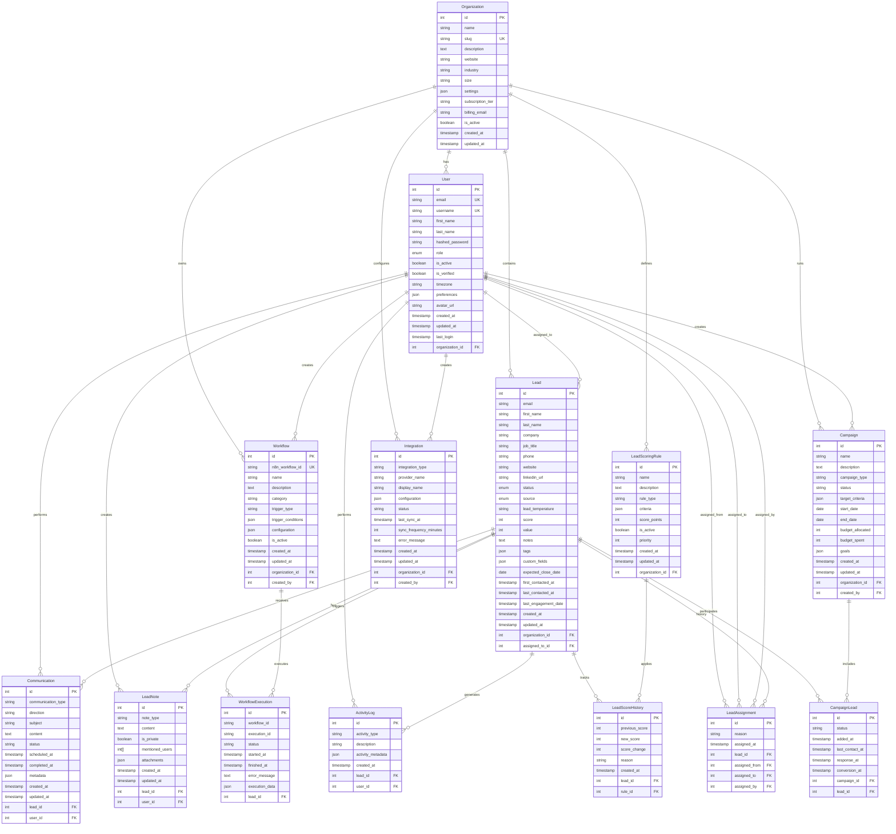

# Database Entity-Relationship Diagram

## LMA Platform - Complete ER Diagram

## Entity Descriptions

### Core Business Entities

#### Organization
- **Purpose**: Multi-tenant isolation and configuration
- **Key Features**: Subscription management, settings, billing
- **Relationships**: Root entity for all organizational data

#### User
- **Purpose**: Authentication, authorization, and user management
- **Key Features**: Role-based access, preferences, activity tracking
- **Relationships**: Belongs to organization, assigned to leads

#### Lead
- **Purpose**: Central entity for prospect management
- **Key Features**: Contact info, scoring, status tracking, engagement history
- **Relationships**: Core entity connected to most other tables

### Workflow & Automation

#### Workflow
- **Purpose**: n8n workflow template/definition storage
- **Key Features**: Trigger configuration, categorization, status management
- **Relationships**: Links to executions, owned by organization

#### WorkflowExecution
- **Purpose**: Track individual workflow runs and results
- **Key Features**: Status tracking, error handling, execution data
- **Relationships**: Links workflow templates to specific leads

### Lead Management & Scoring

#### LeadScoringRule
- **Purpose**: Define flexible scoring criteria and algorithms
- **Key Features**: JSON-based criteria, priority weighting, rule types
- **Relationships**: Organization-specific, applied to lead scoring

#### LeadScoreHistory
- **Purpose**: Audit trail for score changes over time
- **Key Features**: Score change tracking, reason logging, rule attribution
- **Relationships**: Tracks lead score evolution with rule references

### Communication & Engagement

#### Communication
- **Purpose**: Comprehensive communication history across all channels
- **Key Features**: Multi-channel support, scheduling, status tracking
- **Relationships**: Links users, leads, and communication events

#### LeadNote
- **Purpose**: Detailed notes, research, and collaboration on leads
- **Key Features**: Type categorization, privacy controls, mentions, attachments
- **Relationships**: User-created content linked to specific leads

### Campaign Management

#### Campaign
- **Purpose**: Organize and track marketing/outreach campaigns
- **Key Features**: Budget tracking, target criteria, performance goals
- **Relationships**: Organization-owned, user-created, includes multiple leads

#### CampaignLead
- **Purpose**: Many-to-many relationship between campaigns and leads
- **Key Features**: Status tracking, timeline management, conversion tracking
- **Relationships**: Junction table with temporal tracking

### Integration & External Systems

#### Integration
- **Purpose**: Manage connections to external systems (CRM, email, etc.)
- **Key Features**: Configuration storage, sync management, error handling
- **Relationships**: Organization-specific integrations with user attribution

### Activity & Audit

#### ActivityLog
- **Purpose**: General activity tracking and audit trail
- **Key Features**: Flexible metadata, activity categorization
- **Relationships**: Links users and leads to specific activities

#### LeadAssignment
- **Purpose**: Track lead ownership changes over time
- **Key Features**: Assignment history, reason tracking, user attribution
- **Relationships**: Historical record of lead ownership changes

## Data Flow Patterns

### Lead Lifecycle Flow
1. **Lead Creation** → Lead table entry
2. **Initial Scoring** → LeadScoringRule evaluation → LeadScoreHistory entry
3. **Assignment** → LeadAssignment entry → User assignment
4. **Communication** → Communication entries → ActivityLog entries
5. **Workflow Triggers** → WorkflowExecution entries
6. **Campaign Association** → CampaignLead entries
7. **Notes & Research** → LeadNote entries
8. **Score Updates** → LeadScoreHistory entries

### Campaign Flow
1. **Campaign Setup** → Campaign table entry
2. **Lead Targeting** → CampaignLead entries based on target_criteria
3. **Communication Execution** → Communication entries
4. **Response Tracking** → CampaignLead status updates
5. **Performance Analysis** → Aggregated reporting from related tables

### Integration Sync Flow
1. **Integration Setup** → Integration table entry
2. **Scheduled Sync** → External system data pull/push
3. **Lead Updates** → Lead table modifications
4. **Activity Logging** → ActivityLog entries for sync activities
5. **Error Handling** → Integration table error_message updates

## Performance Considerations

### Query Optimization Patterns
- **Lead Dashboard**: Organization-scoped lead queries with status/score filtering
- **Activity Timeline**: Time-based queries across Communication, ActivityLog, LeadNote
- **Campaign Performance**: Aggregation queries across Campaign and CampaignLead
- **Scoring Analysis**: Historical scoring trends via LeadScoreHistory

### Index Strategy
- **Foreign Keys**: All FK columns indexed for JOIN performance
- **Composite Indexes**: Multi-column indexes for common filter combinations
- **Partial Indexes**: Filtered indexes for active/non-null records
- **Time-based Indexes**: Descending indexes on timestamp columns for recent-first queries

This ER diagram provides a comprehensive view of the LMA platform's data architecture, supporting complex lead management workflows while maintaining performance and scalability. 